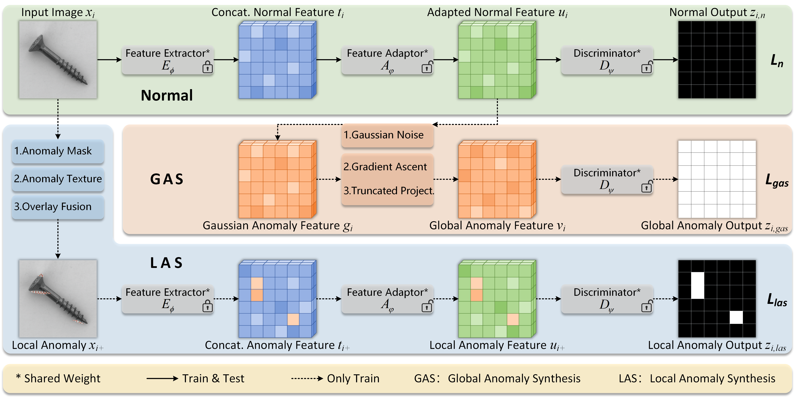
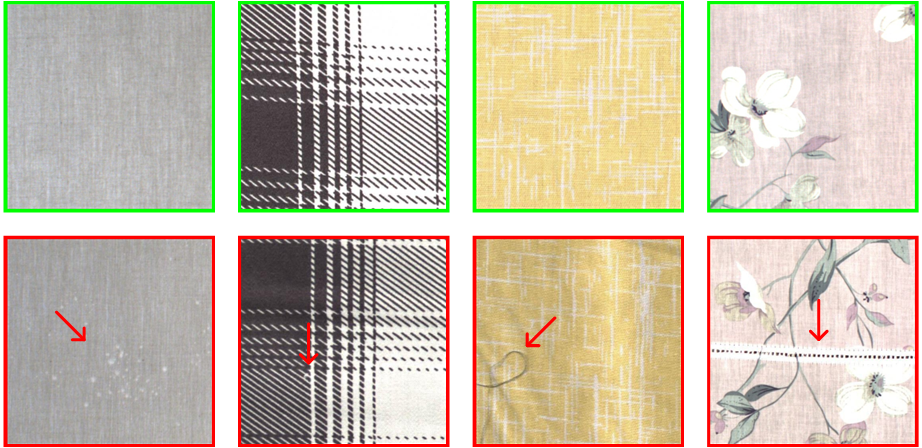
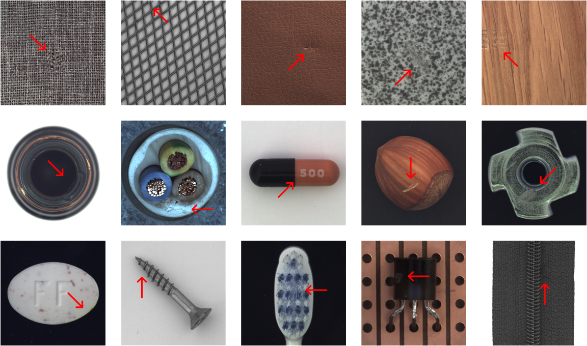
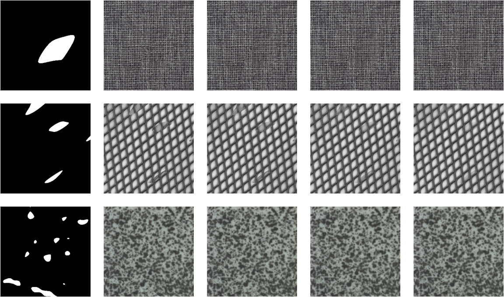

# GLASS


**A Unified Anomaly Synthesis Strategy with Gradient Ascent for Industrial Anomaly Detection and Localization**

_Qiyu Chen, Huiyuan Luo, Chengkan Lv*, Zhengtao Zhang_

## Table of Contents
* [📖 Introduction](#introduction)
* [🔧 Environments](#environments)
* [📊 Data Preparation](#data-preparation)
* [🚀 Run Experiments](#run-experiments)
* [📂 Dataset Release](#dataset-release)
* [🔗 Citation](#citation)
* [🙏 Acknowledgements](#acknowledgements)
* [📜 License](#license)

## Introduction
This repository contains source code for GLASS implemented with PyTorch.
GLASS is a unified framework designed to enhance unsupervised anomaly detection
by addressing the limitations in coverage and controllability of existing anomaly synthesis strategies,
particularly for weak defects resembling normal regions.

This repository also contains the self-built datasets (WFDD, MAD-man, and MAD-sys) proposed in our paper.

## Environments
Create a new conda environment and install required packages.
```
conda create -n glass_env python=3.9.15
conda activate glass_env
pip install -r requirements.txt
```
Experiments are conducted on NVIDIA Tesla A800 (80GB).
Same GPU and package version are recommended. 

## Data Preparation
The public datasets employed in the paper are:

- DTD ([Downdload link](https://www.robots.ox.ac.uk/~vgg/data/dtd/))
- MVTec AD ([Downdload link](https://www.mvtec.com/company/research/datasets/mvtec-ad/))
- VisA ([Downdload link](https://github.com/amazon-science/spot-diff/))
- MPDD ([Downdload link](https://github.com/stepanje/MPDD/))

The DTD dataset is essential for local anomaly synthesis,
while the other datasets are used for anomaly detection evaluation.
These dataset folders/files follow its original structure.

## Run Experiments
Edit `./shell/run-dataset.sh` to configure arguments `--datapath`, `--augpath`, `--classes`, and hyperparameter settings.
Please modify argument `--test` to 'ckpt' / 'test' to toggle between training and testing modes.
```
bash run-dataset.sh
```

## Dataset Release
### 1.WFDD ([Downdload link](https://drive.google.com/file/d/1P8yfNnfoFsb0Lv-HRzkPQ2nD9qsL--Vk/view?usp=sharing/))
The Woven Fabric Defect Detection (WFDD) dataset includes 4101 woven fabric images categorized into 4 categories:
grey cloth, grid cloth, yellow cloth, and pink flower.
The first three classes are collected from the industrial production sites of [WEIQIAO Textile](http://www.wqfz.com/en/),
while the 'pink flower' class is gathered from the publicly available
[Cloth Flaw Dataset](https://tianchi.aliyun.com/dataset/79336?lang=en-us/).
Each category contains block-shape, pointlike, and line-type defects with pixel-level annotations.



### 2.MAD-man ([Downdload link](https://drive.google.com/file/d/1HJmw7hSmrS0NMxfAjDltF4cXlN5S96Iz/view?usp=sharing/))
The MVTec AD-manual (MAD-man) test set is constructed to evaluate weak defect detection.
It includes samples independently selected by 5 individuals from all 15 categories of MVTec AD.
Each subset contains 2 normal and 6 anomaly samples per category.



### 3.MAD-sys ([Downdload link](https://drive.google.com/file/d/1uLGWmOc4D9PuQawE-2nFS3p6XQzKrVsn/view?usp=sharing/))
The MVTec AD-synthesis (MAD-sys) test set is constructed from 5 texture categories of MVTec AD.
It includes 5 subsets with varying degrees of weak defects, adjusted by the transparency coefficient.
Each subset contains 320 normal and 946 anomaly samples.

_Note that due to the weak defects under $\beta=0.9$ being very close to normal,
we did not use this fifth subset in our study.
However, we have chosen to release this subset,
sincerely hoping that future work can further address this challenge._



### 4.Foreground Mask ([Downdload link](https://drive.google.com/file/d/1Fn84QCfMtgBGEDcmY44v97Ci8wwpABK8/view?usp=sharing/))
The foreground masks of normal samples from various datasets are obtained through binarization
inspired by [BGAD](https://github.com/xcyao00/BGAD/).
If a dataset does not have or require the foreground masks,
please set argument `--fg` to '0' in shell script.

## Citation
Please cite the following paper if the code and dataset help your project:

```bibtex
@article{chen2024unified,
  title={A Unified Anomaly Synthesis Strategy with Gradient Ascent for Industrial Anomaly Detection and Localization},
  author={Chen, Qiyu and Luo, Huiyuan and Lv, Chengkan and Zhang, Zhengtao},
  year={2024}
}
```

## Acknowledgements
Thanks for the great inspiration from [SimpleNet](https://github.com/DonaldRR/SimpleNet/).

## License
The code and dataset in this repository are licensed under the [MIT license](https://mit-license.org/).